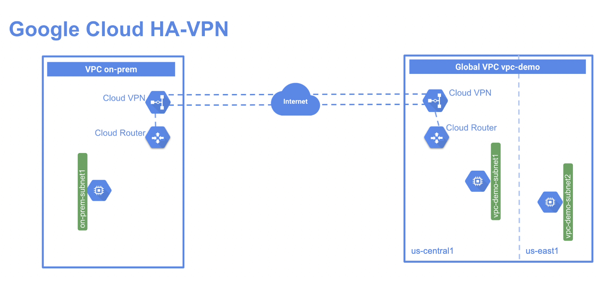

# Implement cloud HA VPN

<https://www.cloudskillsboost.google/course_sessions/2955080/labs/374864>

## Overview

In this lab you create a global VPC called vpc-demo, with two custom subnets in us-east1 and us-central1. In this VPC, you add a Compute Engine instance in each region. You then create a second VPC called on-prem to simulate a customer's on-premises data center. In this second VPC, you add a subnet in region us-central1 and a Compute Engine instance running in this region. Finally, you add an HA VPN and a cloud router in each VPC and run two tunnels from each HA VPN gateway before testing the configuration to verify the 99.99% SLA.

